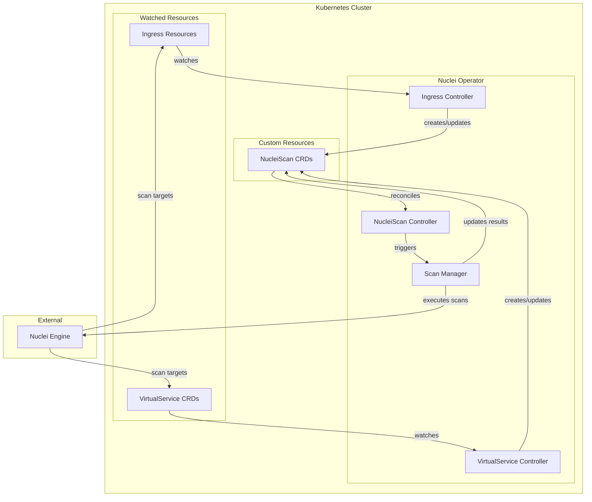
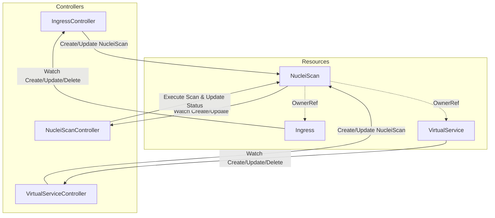
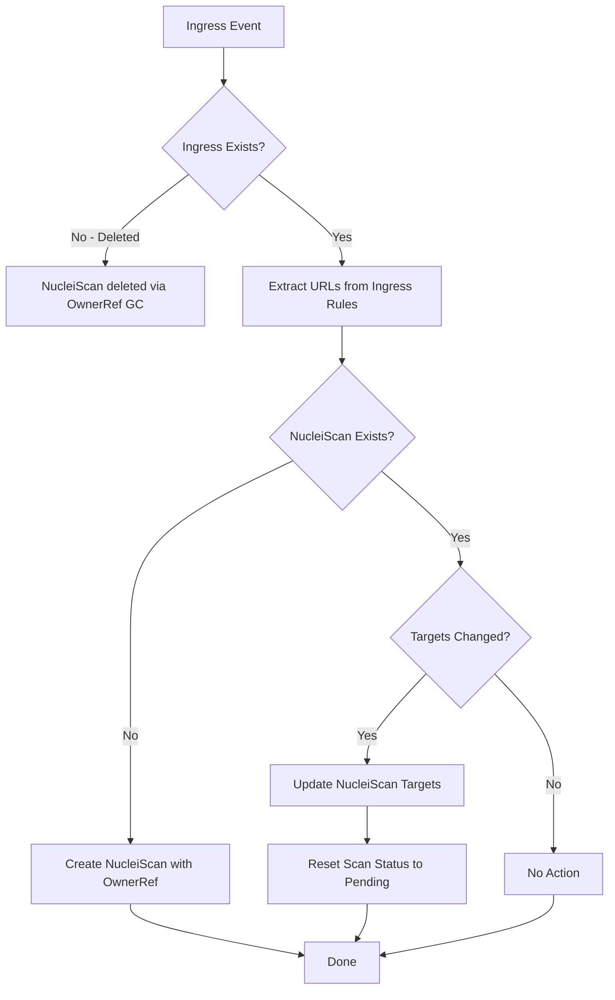
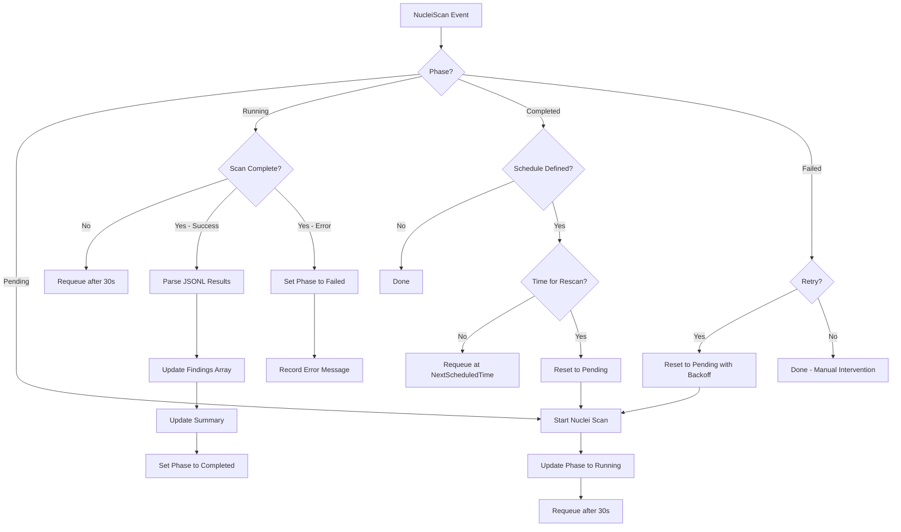
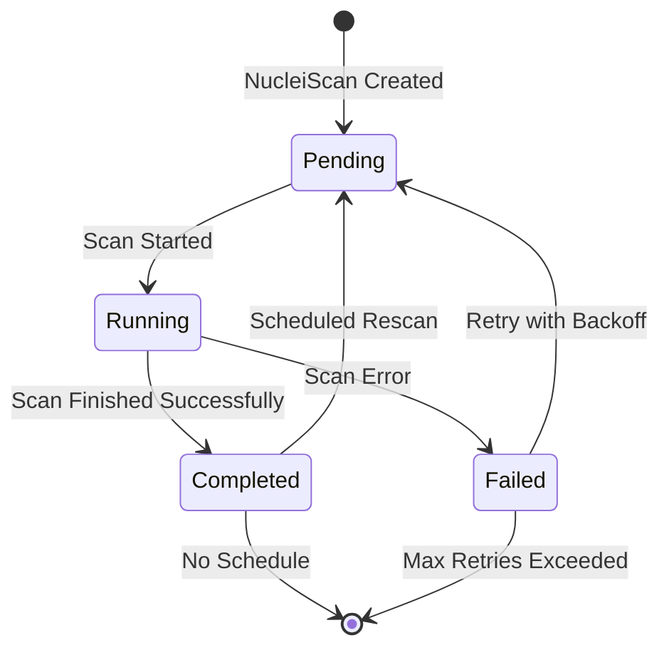
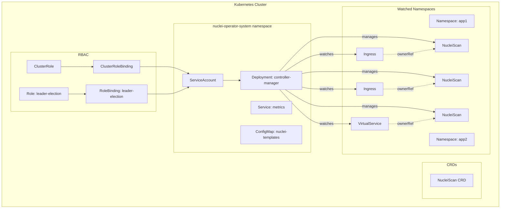

# Nuclei Operator Architecture

## Overview

The Nuclei Operator is a Kubernetes operator that automates security scanning of web applications exposed through Kubernetes Ingress resources and Istio VirtualService CRDs. It uses [Nuclei](https://github.com/projectdiscovery/nuclei), a fast and customizable vulnerability scanner, to perform security assessments and stores the results in a custom Kubernetes resource.



---

## 1. Project Structure

The operator follows the standard Kubebuilder project layout:

```
nuclei-operator/
├── api/
│   └── v1alpha1/
│       ├── groupversion_info.go      # API group/version metadata
│       ├── nucleiscan_types.go       # NucleiScan CRD type definitions
│       └── zz_generated.deepcopy.go  # Auto-generated deep copy methods
├── cmd/
│   └── main.go                       # Operator entry point
├── config/
│   ├── crd/
│   │   └── bases/
│   │       └── nuclei.homelab.mortenolsen.pro_nucleiscans.yaml
│   ├── default/
│   │   └── kustomization.yaml
│   ├── manager/
│   │   └── manager.yaml              # Deployment manifest
│   ├── production/
│   │   ├── kustomization.yaml        # Production overlay
│   │   └── manager_patch.yaml        # Production patches
│   ├── rbac/
│   │   ├── role.yaml                 # ClusterRole
│   │   ├── role_binding.yaml         # ClusterRoleBinding
│   │   └── service_account.yaml      # ServiceAccount
│   └── samples/
│       ├── nuclei_v1alpha1_nucleiscan.yaml
│       └── example-ingress.yaml
├── internal/
│   ├── controller/
│   │   ├── ingress_controller.go     # Ingress watcher/controller
│   │   ├── virtualservice_controller.go  # VirtualService watcher/controller
│   │   ├── nucleiscan_controller.go  # NucleiScan reconciler
│   │   ├── nucleiscan_controller_test.go  # Controller tests
│   │   └── suite_test.go             # Test suite setup
│   └── scanner/
│       ├── scanner.go                # Nuclei scan execution logic
│       └── parser.go                 # JSONL output parser
├── test/
│   ├── e2e/
│   │   ├── e2e_suite_test.go         # E2E test suite
│   │   └── e2e_test.go               # E2E tests
│   └── utils/
│       └── utils.go                  # Test utilities
├── docs/
│   ├── api.md                        # API reference
│   └── user-guide.md                 # User guide
├── Dockerfile
├── Makefile
├── go.mod
├── go.sum
├── PROJECT                           # Kubebuilder project metadata
├── ARCHITECTURE.md                   # This file
├── CONTRIBUTING.md                   # Contribution guidelines
└── README.md
```

### Key Directories

| Directory | Purpose |
|-----------|---------|
| `api/v1alpha1/` | CRD type definitions and API versioning |
| `cmd/` | Main entry point for the operator |
| `config/` | Kubernetes manifests for deployment |
| `internal/controller/` | Reconciliation logic for all controllers |
| `internal/scanner/` | Nuclei scan execution and result parsing |
| `test/` | End-to-end tests |
| `docs/` | Additional documentation |

---

## 2. CRD Design

### NucleiScan Custom Resource Definition

**API Group**: `nuclei.homelab.mortenolsen.pro`  
**Version**: `v1alpha1`  
**Kind**: `NucleiScan`

#### Type Definitions

```go
// api/v1alpha1/nucleiscan_types.go

package v1alpha1

import (
    metav1 "k8s.io/apimachinery/pkg/apis/meta/v1"
    "k8s.io/apimachinery/pkg/runtime"
)

// SourceReference identifies the Ingress or VirtualService that triggered this scan
type SourceReference struct {
    // APIVersion of the source resource
    // +kubebuilder:validation:Required
    APIVersion string `json:"apiVersion"`
    
    // Kind of the source resource - Ingress or VirtualService
    // +kubebuilder:validation:Enum=Ingress;VirtualService
    Kind string `json:"kind"`
    
    // Name of the source resource
    // +kubebuilder:validation:Required
    Name string `json:"name"`
    
    // Namespace of the source resource
    // +kubebuilder:validation:Required
    Namespace string `json:"namespace"`
    
    // UID of the source resource for owner reference
    // +kubebuilder:validation:Required
    UID string `json:"uid"`
}

// NucleiScanSpec defines the desired state of NucleiScan
type NucleiScanSpec struct {
    // SourceRef references the Ingress or VirtualService being scanned
    // +kubebuilder:validation:Required
    SourceRef SourceReference `json:"sourceRef"`
    
    // Targets is the list of URLs to scan, extracted from the source resource
    // +kubebuilder:validation:Required
    // +kubebuilder:validation:MinItems=1
    Targets []string `json:"targets"`
    
    // Templates specifies which Nuclei templates to use
    // If empty, uses default templates
    // +optional
    Templates []string `json:"templates,omitempty"`
    
    // Severity filters scan results by severity level
    // +kubebuilder:validation:Enum=info;low;medium;high;critical
    // +optional
    Severity []string `json:"severity,omitempty"`
    
    // Schedule for periodic rescanning in cron format
    // If empty, scan runs once
    // +optional
    Schedule string `json:"schedule,omitempty"`
    
    // Suspend prevents scheduled scans from running
    // +optional
    Suspend bool `json:"suspend,omitempty"`
}

// ScanPhase represents the current phase of the scan
// +kubebuilder:validation:Enum=Pending;Running;Completed;Failed
type ScanPhase string

const (
    ScanPhasePending   ScanPhase = "Pending"
    ScanPhaseRunning   ScanPhase = "Running"
    ScanPhaseCompleted ScanPhase = "Completed"
    ScanPhaseFailed    ScanPhase = "Failed"
)

// Finding represents a single Nuclei scan finding
type Finding struct {
    // TemplateID is the Nuclei template identifier
    TemplateID string `json:"templateId"`
    
    // TemplateName is the human-readable template name
    TemplateName string `json:"templateName,omitempty"`
    
    // Severity of the finding
    Severity string `json:"severity"`
    
    // Type of the finding - http, dns, ssl, etc.
    Type string `json:"type,omitempty"`
    
    // Host that was scanned
    Host string `json:"host"`
    
    // MatchedAt is the specific URL or endpoint where the issue was found
    MatchedAt string `json:"matchedAt,omitempty"`
    
    // ExtractedResults contains any data extracted by the template
    // +optional
    ExtractedResults []string `json:"extractedResults,omitempty"`
    
    // Description provides details about the finding
    // +optional
    Description string `json:"description,omitempty"`
    
    // Reference contains URLs to additional information about the finding
    // +optional
    Reference []string `json:"reference,omitempty"`
    
    // Tags associated with the finding
    // +optional
    Tags []string `json:"tags,omitempty"`
    
    // Timestamp when the finding was discovered
    Timestamp metav1.Time `json:"timestamp"`
    
    // Metadata contains additional template metadata
    // +kubebuilder:pruning:PreserveUnknownFields
    // +optional
    Metadata *runtime.RawExtension `json:"metadata,omitempty"`
}

// ScanSummary provides aggregated statistics about the scan
type ScanSummary struct {
    // TotalFindings is the total number of findings
    TotalFindings int `json:"totalFindings"`
    
    // FindingsBySeverity breaks down findings by severity level
    FindingsBySeverity map[string]int `json:"findingsBySeverity,omitempty"`
    
    // TargetsScanned is the number of targets that were scanned
    TargetsScanned int `json:"targetsScanned"`
    
    // Duration of the scan in seconds
    DurationSeconds int64 `json:"durationSeconds,omitempty"`
}

// NucleiScanStatus defines the observed state of NucleiScan
type NucleiScanStatus struct {
    // Phase represents the current scan phase
    Phase ScanPhase `json:"phase,omitempty"`
    
    // Conditions represent the latest available observations
    // +optional
    Conditions []metav1.Condition `json:"conditions,omitempty"`
    
    // LastScanTime is when the last scan was initiated
    // +optional
    LastScanTime *metav1.Time `json:"lastScanTime,omitempty"`
    
    // CompletionTime is when the last scan completed
    // +optional
    CompletionTime *metav1.Time `json:"completionTime,omitempty"`
    
    // NextScheduledTime is when the next scheduled scan will run
    // +optional
    NextScheduledTime *metav1.Time `json:"nextScheduledTime,omitempty"`
    
    // Summary provides aggregated scan statistics
    // +optional
    Summary *ScanSummary `json:"summary,omitempty"`
    
    // Findings contains the array of scan results from Nuclei JSONL output
    // Each element is a parsed JSON object from Nuclei output
    // +optional
    Findings []Finding `json:"findings,omitempty"`
    
    // LastError contains the error message if the scan failed
    // +optional
    LastError string `json:"lastError,omitempty"`
    
    // ObservedGeneration is the generation observed by the controller
    ObservedGeneration int64 `json:"observedGeneration,omitempty"`
}

// +kubebuilder:object:root=true
// +kubebuilder:subresource:status
// +kubebuilder:resource:shortName=ns;nscan
// +kubebuilder:printcolumn:name="Phase",type=string,JSONPath=`.status.phase`
// +kubebuilder:printcolumn:name="Findings",type=integer,JSONPath=`.status.summary.totalFindings`
// +kubebuilder:printcolumn:name="Source",type=string,JSONPath=`.spec.sourceRef.kind`
// +kubebuilder:printcolumn:name="Age",type=date,JSONPath=`.metadata.creationTimestamp`

// NucleiScan is the Schema for the nucleiscans API
type NucleiScan struct {
    metav1.TypeMeta   `json:",inline"`
    metav1.ObjectMeta `json:"metadata,omitempty"`

    Spec   NucleiScanSpec   `json:"spec,omitempty"`
    Status NucleiScanStatus `json:"status,omitempty"`
}

// +kubebuilder:object:root=true

// NucleiScanList contains a list of NucleiScan
type NucleiScanList struct {
    metav1.TypeMeta `json:",inline"`
    metav1.ListMeta `json:"metadata,omitempty"`
    Items           []NucleiScan `json:"items"`
}
```

#### Example NucleiScan Resource

```yaml
apiVersion: nuclei.homelab.mortenolsen.pro/v1alpha1
kind: NucleiScan
metadata:
  name: myapp-ingress-scan
  namespace: default
  ownerReferences:
    - apiVersion: networking.k8s.io/v1
      kind: Ingress
      name: myapp-ingress
      uid: abc123-def456-ghi789
      controller: true
      blockOwnerDeletion: true
spec:
  sourceRef:
    apiVersion: networking.k8s.io/v1
    kind: Ingress
    name: myapp-ingress
    namespace: default
    uid: abc123-def456-ghi789
  targets:
    - https://myapp.example.com
    - https://api.myapp.example.com
  severity:
    - medium
    - high
    - critical
status:
  phase: Completed
  lastScanTime: "2024-01-15T10:30:00Z"
  completionTime: "2024-01-15T10:35:00Z"
  observedGeneration: 1
  summary:
    totalFindings: 3
    findingsBySeverity:
      medium: 2
      high: 1
    targetsScanned: 2
    durationSeconds: 300
  findings:
    - templateId: CVE-2021-44228
      templateName: Log4j RCE
      severity: critical
      type: http
      host: https://myapp.example.com
      matchedAt: https://myapp.example.com/api/login
      timestamp: "2024-01-15T10:32:00Z"
    - templateId: ssl-weak-cipher
      templateName: Weak SSL Cipher Detected
      severity: medium
      type: ssl
      host: https://api.myapp.example.com
      timestamp: "2024-01-15T10:33:00Z"
  conditions:
    - type: Ready
      status: "True"
      lastTransitionTime: "2024-01-15T10:35:00Z"
      reason: ScanCompleted
      message: Scan completed successfully with 3 findings
```

---

## 3. Controller Design

The operator uses three controllers working together:



### 3.1 Ingress Controller

**Purpose**: Watches Ingress resources and creates/updates corresponding NucleiScan resources.

```go
// internal/controller/ingress_controller.go

type IngressReconciler struct {
    client.Client
    Scheme *runtime.Scheme
}

// Reconcile handles Ingress events
func (r *IngressReconciler) Reconcile(ctx context.Context, req ctrl.Request) (ctrl.Result, error) {
    // 1. Fetch the Ingress
    // 2. Check if NucleiScan exists for this Ingress
    // 3. Extract target URLs from Ingress rules
    // 4. Create or update NucleiScan with owner reference
    // 5. Handle Ingress deletion via owner reference garbage collection
}

// SetupWithManager sets up the controller with the Manager
func (r *IngressReconciler) SetupWithManager(mgr ctrl.Manager) error {
    return ctrl.NewControllerManagedBy(mgr).
        For(&networkingv1.Ingress{}).
        Owns(&nucleiv1alpha1.NucleiScan{}).
        Complete(r)
}
```

**Reconciliation Flow**:



### 3.2 VirtualService Controller

**Purpose**: Watches Istio VirtualService resources and creates/updates corresponding NucleiScan resources.

```go
// internal/controller/virtualservice_controller.go

type VirtualServiceReconciler struct {
    client.Client
    Scheme *runtime.Scheme
}

// Reconcile handles VirtualService events
func (r *VirtualServiceReconciler) Reconcile(ctx context.Context, req ctrl.Request) (ctrl.Result, error) {
    // 1. Fetch the VirtualService
    // 2. Check if NucleiScan exists for this VirtualService
    // 3. Extract target URLs from VirtualService hosts
    // 4. Create or update NucleiScan with owner reference
    // 5. Handle VirtualService deletion via owner reference garbage collection
}

// SetupWithManager sets up the controller with the Manager
func (r *VirtualServiceReconciler) SetupWithManager(mgr ctrl.Manager) error {
    return ctrl.NewControllerManagedBy(mgr).
        For(&istionetworkingv1beta1.VirtualService{}).
        Owns(&nucleiv1alpha1.NucleiScan{}).
        Complete(r)
}
```

### 3.3 NucleiScan Controller

**Purpose**: Reconciles NucleiScan resources and executes Nuclei scans.

```go
// internal/controller/nucleiscan_controller.go

type NucleiScanReconciler struct {
    client.Client
    Scheme  *runtime.Scheme
    Scanner scanner.Scanner
}

// Reconcile handles NucleiScan events
func (r *NucleiScanReconciler) Reconcile(ctx context.Context, req ctrl.Request) (ctrl.Result, error) {
    // 1. Fetch the NucleiScan
    // 2. Check current phase
    // 3. If Pending: start scan, update to Running
    // 4. If Running: check scan status, update results when complete
    // 5. If Completed/Failed: check if rescan needed based on schedule
    // 6. Update status conditions
}

// SetupWithManager sets up the controller with the Manager
func (r *NucleiScanReconciler) SetupWithManager(mgr ctrl.Manager) error {
    return ctrl.NewControllerManagedBy(mgr).
        For(&nucleiv1alpha1.NucleiScan{}).
        Complete(r)
}
```

**Reconciliation Flow**:



### Controller Registration

```go
// cmd/main.go

func main() {
    // ... setup code ...
    
    mgr, err := ctrl.NewManager(ctrl.GetConfigOrDie(), ctrl.Options{
        Scheme:                 scheme,
        MetricsBindAddress:     metricsAddr,
        Port:                   9443,
        HealthProbeBindAddress: probeAddr,
        LeaderElection:         enableLeaderElection,
        LeaderElectionID:       "nuclei-operator.homelab.mortenolsen.pro",
    })
    
    // Register Ingress Controller
    if err = (&controller.IngressReconciler{
        Client: mgr.GetClient(),
        Scheme: mgr.GetScheme(),
    }).SetupWithManager(mgr); err != nil {
        setupLog.Error(err, "unable to create controller", "controller", "Ingress")
        os.Exit(1)
    }
    
    // Register VirtualService Controller
    if err = (&controller.VirtualServiceReconciler{
        Client: mgr.GetClient(),
        Scheme: mgr.GetScheme(),
    }).SetupWithManager(mgr); err != nil {
        setupLog.Error(err, "unable to create controller", "controller", "VirtualService")
        os.Exit(1)
    }
    
    // Register NucleiScan Controller
    if err = (&controller.NucleiScanReconciler{
        Client:  mgr.GetClient(),
        Scheme:  mgr.GetScheme(),
        Scanner: scanner.NewNucleiScanner(),
    }).SetupWithManager(mgr); err != nil {
        setupLog.Error(err, "unable to create controller", "controller", "NucleiScan")
        os.Exit(1)
    }
    
    // ... start manager ...
}
```

---

## 4. Scanning Strategy

### 4.1 URL Extraction

#### From Ingress Resources

```go
// internal/util/url_extractor.go

func ExtractURLsFromIngress(ingress *networkingv1.Ingress) []string {
    var urls []string
    
    // Extract from TLS hosts - these are HTTPS
    for _, tls := range ingress.Spec.TLS {
        for _, host := range tls.Hosts {
            urls = append(urls, fmt.Sprintf("https://%s", host))
        }
    }
    
    // Extract from rules
    for _, rule := range ingress.Spec.Rules {
        if rule.Host != "" {
            // Check if host is in TLS list
            isHTTPS := false
            for _, tls := range ingress.Spec.TLS {
                for _, tlsHost := range tls.Hosts {
                    if tlsHost == rule.Host {
                        isHTTPS = true
                        break
                    }
                }
            }
            
            scheme := "http"
            if isHTTPS {
                scheme = "https"
            }
            
            // Add paths if defined
            if rule.HTTP != nil {
                for _, path := range rule.HTTP.Paths {
                    urls = append(urls, fmt.Sprintf("%s://%s%s", scheme, rule.Host, path.Path))
                }
            } else {
                urls = append(urls, fmt.Sprintf("%s://%s", scheme, rule.Host))
            }
        }
    }
    
    return deduplicateURLs(urls)
}
```

#### From VirtualService Resources

```go
func ExtractURLsFromVirtualService(vs *istionetworkingv1beta1.VirtualService) []string {
    var urls []string
    
    // VirtualService hosts can be FQDNs or short names
    for _, host := range vs.Spec.Hosts {
        // Skip wildcard hosts
        if strings.HasPrefix(host, "*") {
            continue
        }
        
        // Determine protocol from Gateway configuration
        // Default to HTTPS for security scanning
        scheme := "https"
        
        // Extract paths from HTTP routes
        for _, httpRoute := range vs.Spec.Http {
            for _, match := range httpRoute.Match {
                if match.Uri != nil {
                    if match.Uri.Prefix != "" {
                        urls = append(urls, fmt.Sprintf("%s://%s%s", scheme, host, match.Uri.Prefix))
                    } else if match.Uri.Exact != "" {
                        urls = append(urls, fmt.Sprintf("%s://%s%s", scheme, host, match.Uri.Exact))
                    }
                }
            }
        }
        
        // If no specific paths, add base URL
        if len(urls) == 0 {
            urls = append(urls, fmt.Sprintf("%s://%s", scheme, host))
        }
    }
    
    return deduplicateURLs(urls)
}
```

### 4.2 Scan Execution

The scanner implementation uses a synchronous execution model where scans complete within the reconcile loop.

**Location**: `internal/scanner/scanner.go`

```go
// Scanner defines the interface for executing Nuclei scans
type Scanner interface {
    // Scan executes a Nuclei scan against the given targets and returns the results
    Scan(ctx context.Context, targets []string, options ScanOptions) (*ScanResult, error)
}

// ScanOptions contains configuration options for a scan
type ScanOptions struct {
    Templates []string      // Nuclei templates to use
    Severity  []string      // Severity filter
    Timeout   time.Duration // Maximum scan duration
}

// ScanResult contains the results of a completed scan
type ScanResult struct {
    Findings []nucleiv1alpha1.Finding
    Summary  nucleiv1alpha1.ScanSummary
    Duration time.Duration
}

// NucleiScanner implements the Scanner interface using the Nuclei binary
type NucleiScanner struct {
    nucleiBinaryPath string
    templatesPath    string
}

// Configuration via environment variables:
// - NUCLEI_BINARY_PATH: Path to nuclei binary (default: "nuclei")
// - NUCLEI_TEMPLATES_PATH: Path to templates directory (default: uses nuclei default)
// - NUCLEI_TIMEOUT: Default scan timeout (default: 30m)

func NewNucleiScannerWithDefaults() *NucleiScanner {
    return NewNucleiScanner(DefaultConfig())
}

func (s *NucleiScanner) Scan(ctx context.Context, targets []string, options ScanOptions) (*ScanResult, error) {
    // 1. Create temporary directory for scan
    // 2. Write targets to file
    // 3. Build nuclei command arguments
    // 4. Execute nuclei with context timeout
    // 5. Parse JSONL output
    // 6. Calculate summary statistics
    // 7. Return results
}
```

**Command Arguments**:
```go
args := []string{
    "-l", targetsFile,      // Target list file
    "-jsonl",               // JSON Lines output format
    "-silent",              // Suppress banner
    "-no-color",            // No ANSI colors
}

if s.templatesPath != "" {
    args = append(args, "-t", s.templatesPath)
}

if len(options.Templates) > 0 {
    for _, t := range options.Templates {
        args = append(args, "-t", t)
    }
}

if len(options.Severity) > 0 {
    args = append(args, "-severity", strings.Join(options.Severity, ","))
}
```

### 4.3 JSONL Parsing

**Location**: `internal/scanner/parser.go`

The parser handles Nuclei's JSONL output format, which can have varying field types (strings vs arrays).

```go
// NucleiOutput represents the structure of Nuclei's JSONL output
type NucleiOutput struct {
    TemplateID       string     `json:"template-id"`
    TemplatePath     string     `json:"template-path"`
    Info             NucleiInfo `json:"info"`
    Type             string     `json:"type"`
    Host             string     `json:"host"`
    MatchedAt        string     `json:"matched-at"`
    Timestamp        string     `json:"timestamp"`
    ExtractedResults interface{} `json:"extracted-results,omitempty"`
    MatcherName      string     `json:"matcher-name,omitempty"`
    IP               string     `json:"ip,omitempty"`
}

type NucleiInfo struct {
    Name        string      `json:"name"`
    Author      interface{} `json:"author"`      // Can be string or []string
    Tags        interface{} `json:"tags"`        // Can be string or []string
    Description string      `json:"description,omitempty"`
    Severity    string      `json:"severity"`
    Reference   interface{} `json:"reference,omitempty"` // Can be string or []string
    Metadata    interface{} `json:"metadata,omitempty"`
}

// ParseJSONLOutput parses Nuclei's JSONL output and returns a slice of Findings
func ParseJSONLOutput(output []byte) ([]nucleiv1alpha1.Finding, error) {
    var findings []nucleiv1alpha1.Finding
    scanner := bufio.NewScanner(bytes.NewReader(output))
    
    for scanner.Scan() {
        line := scanner.Bytes()
        if len(line) == 0 || !bytes.HasPrefix(bytes.TrimSpace(line), []byte("{")) {
            continue // Skip empty lines and non-JSON output
        }
        
        finding, err := parseJSONLine(line)
        if err != nil {
            continue // Log warning but continue parsing
        }
        findings = append(findings, finding)
    }
    
    return findings, scanner.Err()
}

// parseStringSlice handles fields that can be string or []string
func parseStringSlice(v interface{}) []string {
    switch val := v.(type) {
    case string:
        if strings.Contains(val, ",") {
            return strings.Split(val, ",")
        }
        return []string{val}
    case []interface{}:
        result := make([]string, 0, len(val))
        for _, item := range val {
            if s, ok := item.(string); ok {
                result = append(result, s)
            }
        }
        return result
    }
    return nil
}
```

### 4.4 Scan Lifecycle State Machine



**Phase Transitions**:

| From | To | Trigger | Actions |
|------|-----|---------|---------|
| - | Pending | NucleiScan created | Initialize status |
| Pending | Running | Reconciler picks up | Start Nuclei process, set LastScanTime |
| Running | Completed | Scan finishes | Parse results, update Findings, set CompletionTime |
| Running | Failed | Scan error | Record error, increment retry count |
| Completed | Pending | Schedule triggers | Reset status, calculate NextScheduledTime |
| Failed | Pending | Retry backoff elapsed | Reset status, increment attempt |

---

## 5. Owner References

Owner references ensure that NucleiScan resources are automatically garbage collected when their source Ingress or VirtualService is deleted.

### Implementation

```go
// internal/util/owner_reference.go

import (
    metav1 "k8s.io/apimachinery/pkg/apis/meta/v1"
    "k8s.io/apimachinery/pkg/runtime"
    "sigs.k8s.io/controller-runtime/pkg/controller/controllerutil"
)

// SetOwnerReference sets the owner reference on a NucleiScan
func SetOwnerReference(owner metav1.Object, owned metav1.Object, scheme *runtime.Scheme) error {
    return controllerutil.SetControllerReference(owner, owned, scheme)
}

// CreateOwnerReference creates an owner reference for cross-namespace scenarios
// Note: Standard owner references require same namespace
func CreateOwnerReference(owner metav1.Object, blockOwnerDeletion bool) metav1.OwnerReference {
    return metav1.OwnerReference{
        APIVersion:         owner.GetObjectKind().GroupVersionKind().GroupVersion().String(),
        Kind:               owner.GetObjectKind().GroupVersionKind().Kind,
        Name:               owner.GetName(),
        UID:                owner.GetUID(),
        Controller:         ptr.To(true),
        BlockOwnerDeletion: ptr.To(blockOwnerDeletion),
    }
}
```

### Usage in Controllers

```go
// In IngressReconciler.Reconcile()
func (r *IngressReconciler) createNucleiScan(ctx context.Context, ingress *networkingv1.Ingress) error {
    nucleiScan := &nucleiv1alpha1.NucleiScan{
        ObjectMeta: metav1.ObjectMeta{
            Name:      fmt.Sprintf("%s-scan", ingress.Name),
            Namespace: ingress.Namespace,
        },
        Spec: nucleiv1alpha1.NucleiScanSpec{
            SourceRef: nucleiv1alpha1.SourceReference{
                APIVersion: "networking.k8s.io/v1",
                Kind:       "Ingress",
                Name:       ingress.Name,
                Namespace:  ingress.Namespace,
                UID:        string(ingress.UID),
            },
            Targets: util.ExtractURLsFromIngress(ingress),
        },
    }
    
    // Set owner reference - this enables garbage collection
    if err := controllerutil.SetControllerReference(ingress, nucleiScan, r.Scheme); err != nil {
        return fmt.Errorf("failed to set owner reference: %w", err)
    }
    
    return r.Create(ctx, nucleiScan)
}
```

### Owner Reference Behavior

| Scenario | Behavior |
|----------|----------|
| Ingress deleted | NucleiScan automatically deleted by Kubernetes GC |
| VirtualService deleted | NucleiScan automatically deleted by Kubernetes GC |
| NucleiScan manually deleted | Recreated by Ingress/VS controller on next reconcile |
| Ingress updated | NucleiScan targets updated, scan re-triggered |

### Important Considerations

1. **Same Namespace Requirement**: Owner references only work within the same namespace. The NucleiScan must be created in the same namespace as the source Ingress/VirtualService.

2. **Controller Reference**: Using `SetControllerReference` ensures:
   - Only one controller owns the resource
   - `controller: true` is set in the owner reference
   - `blockOwnerDeletion: true` prevents premature deletion

3. **Finalizers**: Consider adding finalizers if cleanup actions are needed before deletion:

```go
const finalizerName = "nuclei.homelab.mortenolsen.pro/finalizer"

func (r *NucleiScanReconciler) Reconcile(ctx context.Context, req ctrl.Request) (ctrl.Result, error) {
    nucleiScan := &nucleiv1alpha1.NucleiScan{}
    if err := r.Get(ctx, req.NamespacedName, nucleiScan); err != nil {
        return ctrl.Result{}, client.IgnoreNotFound(err)
    }
    
    // Check if being deleted
    if !nucleiScan.DeletionTimestamp.IsZero() {
        if controllerutil.ContainsFinalizer(nucleiScan, finalizerName) {
            // Perform cleanup (cancel running scans, etc.)
            if err := r.Scanner.CancelScan(ctx, nucleiScan.Name); err != nil {
                return ctrl.Result{}, err
            }
            
            // Remove finalizer
            controllerutil.RemoveFinalizer(nucleiScan, finalizerName)
            if err := r.Update(ctx, nucleiScan); err != nil {
                return ctrl.Result{}, err
            }
        }
        return ctrl.Result{}, nil
    }
    
    // Add finalizer if not present
    if !controllerutil.ContainsFinalizer(nucleiScan, finalizerName) {
        controllerutil.AddFinalizer(nucleiScan, finalizerName)
        if err := r.Update(ctx, nucleiScan); err != nil {
            return ctrl.Result{}, err
        }
    }
    
    // ... rest of reconciliation
}
```

---

## 6. RBAC Requirements

The operator requires specific permissions to watch, create, and manage resources across the cluster.

### ClusterRole Definition

```yaml
# config/rbac/role.yaml
apiVersion: rbac.authorization.k8s.io/v1
kind: ClusterRole
metadata:
  name: nuclei-operator-manager-role
rules:
  # Core API - Events for recording
  - apiGroups: [""]
    resources: ["events"]
    verbs: ["create", "patch"]
  
  # Networking API - Ingress resources
  - apiGroups: ["networking.k8s.io"]
    resources: ["ingresses"]
    verbs: ["get", "list", "watch"]
  
  # Istio API - VirtualService resources
  - apiGroups: ["networking.istio.io"]
    resources: ["virtualservices"]
    verbs: ["get", "list", "watch"]
  
  # Nuclei Operator API - NucleiScan resources
  - apiGroups: ["nuclei.homelab.mortenolsen.pro"]
    resources: ["nucleiscans"]
    verbs: ["get", "list", "watch", "create", "update", "patch", "delete"]
  
  - apiGroups: ["nuclei.homelab.mortenolsen.pro"]
    resources: ["nucleiscans/status"]
    verbs: ["get", "update", "patch"]
  
  - apiGroups: ["nuclei.homelab.mortenolsen.pro"]
    resources: ["nucleiscans/finalizers"]
    verbs: ["update"]
```

### Leader Election Role

```yaml
# config/rbac/leader_election_role.yaml
apiVersion: rbac.authorization.k8s.io/v1
kind: Role
metadata:
  name: nuclei-operator-leader-election-role
  namespace: nuclei-operator-system
rules:
  - apiGroups: [""]
    resources: ["configmaps"]
    verbs: ["get", "list", "watch", "create", "update", "patch", "delete"]
  
  - apiGroups: ["coordination.k8s.io"]
    resources: ["leases"]
    verbs: ["get", "list", "watch", "create", "update", "patch", "delete"]
  
  - apiGroups: [""]
    resources: ["events"]
    verbs: ["create", "patch"]
```

### ServiceAccount and Bindings

```yaml
# config/rbac/service_account.yaml
apiVersion: v1
kind: ServiceAccount
metadata:
  name: nuclei-operator-controller-manager
  namespace: nuclei-operator-system
---
# config/rbac/role_binding.yaml
apiVersion: rbac.authorization.k8s.io/v1
kind: ClusterRoleBinding
metadata:
  name: nuclei-operator-manager-rolebinding
roleRef:
  apiGroup: rbac.authorization.k8s.io
  kind: ClusterRole
  name: nuclei-operator-manager-role
subjects:
  - kind: ServiceAccount
    name: nuclei-operator-controller-manager
    namespace: nuclei-operator-system
---
# config/rbac/leader_election_role_binding.yaml
apiVersion: rbac.authorization.k8s.io/v1
kind: RoleBinding
metadata:
  name: nuclei-operator-leader-election-rolebinding
  namespace: nuclei-operator-system
roleRef:
  apiGroup: rbac.authorization.k8s.io
  kind: Role
  name: nuclei-operator-leader-election-role
subjects:
  - kind: ServiceAccount
    name: nuclei-operator-controller-manager
    namespace: nuclei-operator-system
```

### RBAC Summary Table

| Resource | API Group | Verbs | Purpose |
|----------|-----------|-------|---------|
| ingresses | networking.k8s.io | get, list, watch | Watch Ingress resources for changes |
| virtualservices | networking.istio.io | get, list, watch | Watch VirtualService resources for changes |
| nucleiscans | nuclei.homelab.mortenolsen.pro | all | Full control over NucleiScan CRDs |
| nucleiscans/status | nuclei.homelab.mortenolsen.pro | get, update, patch | Update scan status and results |
| nucleiscans/finalizers | nuclei.homelab.mortenolsen.pro | update | Manage finalizers for cleanup |
| events | core | create, patch | Record events for observability |
| configmaps | core | all | Leader election coordination |
| leases | coordination.k8s.io | all | Leader election coordination |

---

## 7. Deployment Architecture

### Operator Deployment

```yaml
# config/manager/manager.yaml
apiVersion: apps/v1
kind: Deployment
metadata:
  name: nuclei-operator-controller-manager
  namespace: nuclei-operator-system
  labels:
    control-plane: controller-manager
spec:
  replicas: 1
  selector:
    matchLabels:
      control-plane: controller-manager
  template:
    metadata:
      labels:
        control-plane: controller-manager
    spec:
      serviceAccountName: nuclei-operator-controller-manager
      terminationGracePeriodSeconds: 10
      securityContext:
        runAsNonRoot: true
        seccompProfile:
          type: RuntimeDefault
      containers:
        - name: manager
          image: nuclei-operator:latest
          command:
            - /manager
          args:
            - --leader-elect
            - --health-probe-bind-address=:8081
            - --metrics-bind-address=:8080
          securityContext:
            allowPrivilegeEscalation: false
            capabilities:
              drop:
                - ALL
            readOnlyRootFilesystem: true
          ports:
            - containerPort: 8080
              name: metrics
              protocol: TCP
            - containerPort: 8081
              name: health
              protocol: TCP
          livenessProbe:
            httpGet:
              path: /healthz
              port: 8081
            initialDelaySeconds: 15
            periodSeconds: 20
          readinessProbe:
            httpGet:
              path: /readyz
              port: 8081
            initialDelaySeconds: 5
            periodSeconds: 10
          resources:
            limits:
              cpu: 500m
              memory: 256Mi
            requests:
              cpu: 100m
              memory: 128Mi
          volumeMounts:
            - name: nuclei-templates
              mountPath: /nuclei-templates
              readOnly: true
            - name: scan-workspace
              mountPath: /tmp/nuclei-scans
      volumes:
        - name: nuclei-templates
          configMap:
            name: nuclei-templates
        - name: scan-workspace
          emptyDir: {}
```

### High-Level Deployment Diagram



---

## 8. Future Considerations

### Potential Enhancements

1. **Webhook Validation**: Add admission webhooks to validate NucleiScan resources before creation.

2. **Metrics and Monitoring**: Expose Prometheus metrics for:
   - Scan duration histograms
   - Finding counts by severity
   - Scan success/failure rates

3. **Notification Integration**: Send alerts when critical vulnerabilities are found via:
   - Slack webhooks
   - PagerDuty
   - Email

4. **Template Management**: CRD for managing Nuclei templates:
   ```yaml
   apiVersion: nuclei.homelab.mortenolsen.pro/v1alpha1
   kind: NucleiTemplate
   metadata:
     name: custom-templates
   spec:
     gitRepository: https://github.com/org/nuclei-templates
     branch: main
     syncInterval: 1h
   ```

5. **Scan Policies**: Define scanning policies at namespace or cluster level:
   ```yaml
   apiVersion: nuclei.homelab.mortenolsen.pro/v1alpha1
   kind: ScanPolicy
   metadata:
     name: default-policy
   spec:
     schedule: "0 2 * * *"  # Daily at 2 AM
     severity:
       - medium
       - high
       - critical
     excludeTemplates: []
     namespaceSelector:
       matchLabels:
         scan-enabled: "true"
   ```

6. **Multi-cluster Support**: Extend to scan resources across multiple clusters using cluster federation.

---

## Appendix A: Nuclei JSONL Output Format

Example Nuclei JSONL output that will be parsed into the Findings array:

```json
{"template":"cves/2021/CVE-2021-44228.yaml","template-id":"CVE-2021-44228","template-path":"/nuclei-templates/cves/2021/CVE-2021-44228.yaml","info":{"name":"Apache Log4j RCE","author":["pdteam"],"tags":["cve","cve2021","rce","log4j"],"description":"Apache Log4j2 <=2.14.1 JNDI features...","severity":"critical","reference":["https://nvd.nist.gov/vuln/detail/CVE-2021-44228"]},"type":"http","host":"https://example.com","matched-at":"https://example.com/api/login","timestamp":"2024-01-15T10:32:00.000Z"}
```

```json
{"template":"ssl/weak-cipher-suites.yaml","template-id":"ssl-weak-cipher","template-path":"/nuclei-templates/ssl/weak-cipher-suites.yaml","info":{"name":"Weak SSL Cipher Suites","author":["pdteam"],"tags":["ssl","tls","cipher"],"description":"Weak SSL cipher suites detected","severity":"medium"},"type":"ssl","host":"https://api.example.com","matched-at":"https://api.example.com:443","timestamp":"2024-01-15T10:33:00.000Z"}
```

---

## Appendix B: Quick Reference Commands

```bash
# Initialize Kubebuilder project
kubebuilder init --domain homelab.mortenolsen.pro --repo github.com/mortenolsen/nuclei-operator

# Create API and Controller
kubebuilder create api --group nuclei --version v1alpha1 --kind NucleiScan

# Generate CRD manifests
make manifests

# Install CRDs into cluster
make install

# Run operator locally
make run

# Build and push operator image
make docker-build docker-push IMG=<registry>/nuclei-operator:tag

# Deploy to cluster
make deploy IMG=<registry>/nuclei-operator:tag
```

---

## Appendix C: Testing Strategy

### Unit Tests

```go
// internal/controller/ingress_controller_test.go

var _ = Describe("Ingress Controller", func() {
    Context("When reconciling an Ingress", func() {
        It("Should create a NucleiScan for a new Ingress", func() {
            // Test implementation
        })
        
        It("Should update NucleiScan when Ingress hosts change", func() {
            // Test implementation
        })
        
        It("Should not create duplicate NucleiScans", func() {
            // Test implementation
        })
    })
})
```

### Integration Tests

```go
// internal/controller/suite_test.go

var _ = BeforeSuite(func() {
    // Setup test environment with envtest
    testEnv = &envtest.Environment{
        CRDDirectoryPaths: []string{
            filepath.Join("..", "..", "config", "crd", "bases"),
        },
    }
    // ...
})
```

### End-to-End Tests

```bash
# Deploy to kind cluster and run e2e tests
make test-e2e
```